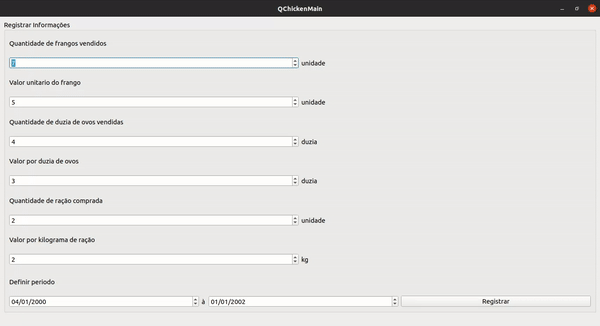

<h1 align="center">Welcome to QChicken 👋</h1>
<p>
  <a href="#" target="_blank">
    
  </a>
    
  <a href="https://twitter.com/mrlucasrib" target="_blank">
    
  </a>
</p>

> QChicken is farm control software


## :rocket: Technologies

This project was developed with the following technologies:

- 
- 


## 💻 Project

This is a college project, where we put the learned content into practice, they are
- Software Architecture
- TDD (Test Driven Development)
- Design Patterns
- Code documentation
- Componentization (linked libraries)




## :information_source: How To Use

### Prerequisites

- C++ Compiler (gcc, clang)
- Qt Framework (qmake and libs)

### Usage

From your command line:
```sh
# Clone repository
$ git clone https://github.com/mrlucasrib/QChicken.git
$ cd QChicken
$ qmake QChicken.pro
$ make
$ sudo chmod +x QChicken
$ ./QChicken
```

## Authors

👤 **Lucas Ribeiro**

* Twitter: [@mrlucasrib](https://twitter.com/mrlucasrib)
* Github: [@mrlucasrib](https://github.com/mrlucasrib)
* LinkedIn: [@mrlucasrib](https://linkedin.com/in/mrlucasrib)

👤 **Pedro Alves**

* Github: [@pedroop23](https://github.com/pedroop23)

👤 **Thiago Borba**

* Github: [@thborba](https://github.com/thborba)

## :memo: License

This project is under the AGPL v3 license. See the [LICENSE](LICENSE) for details.

## Show your support

Give a ⭐️ if you liked this project!
